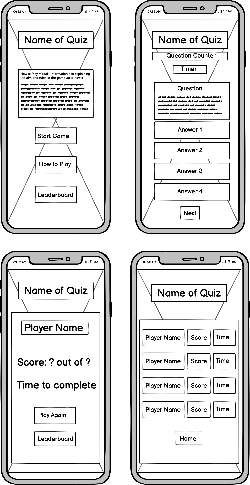
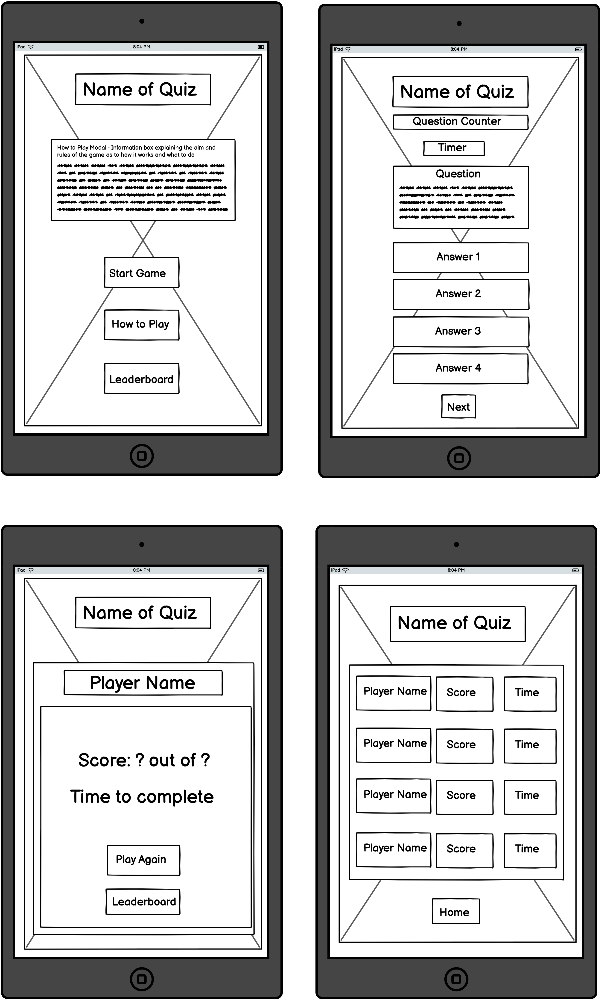
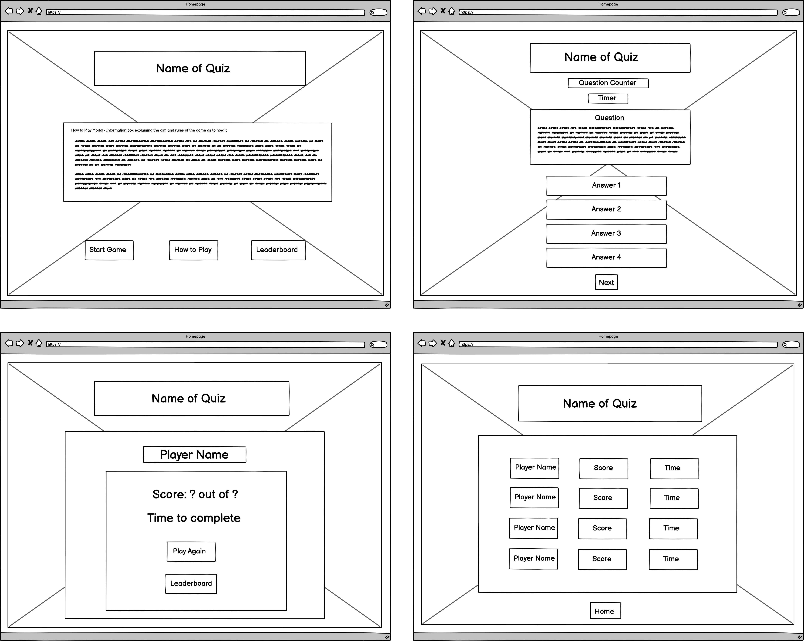
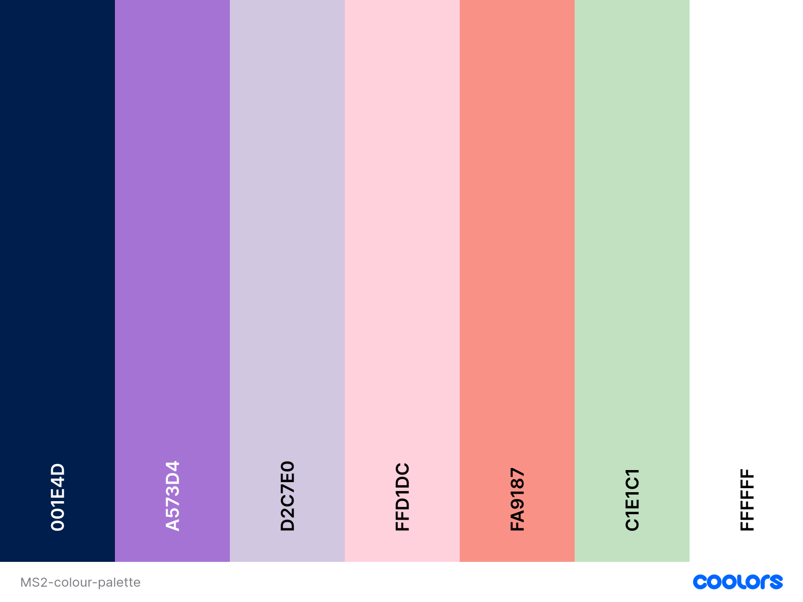
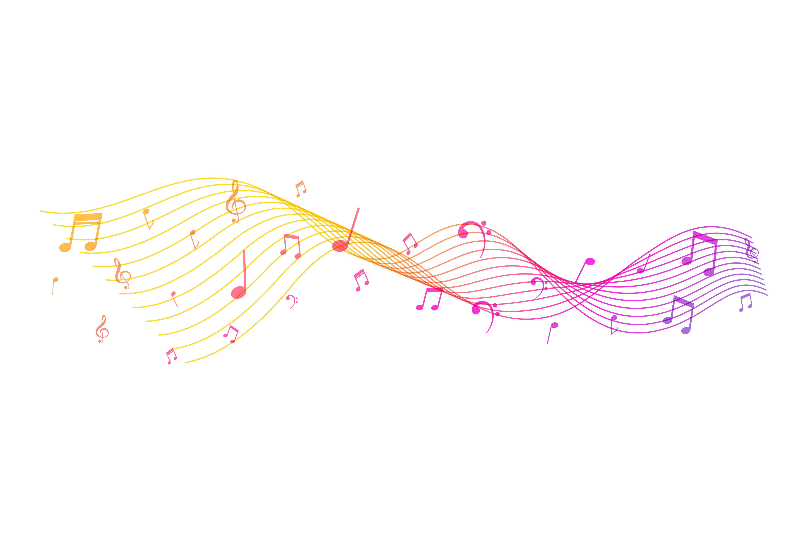

# Musical Guess!  

Welcome to the Musical Guess Quiz! This quiz was created for users to have some musical fun and to test their knowledge of well-known pop music songs, by trying to guess the song title and artist from the lyrics presented.

It has been built using HTML5, CSS3 and JavaScript to allow the user to interact with the website in an engaging way and it was created for the Milestone Project 2 for Code Institute's Diploma in Web Development.

 I am Response

[Link to Live Website](https://k-coll.github.io/mp2-musical-guess-quiz/)

## Table of Contents

* [User Experience (UX)](#user-experience-ux)
  * [Strategy](#strategy)
    * [User Stories](#user-stories)
  * [Scope](#scope)
  * [Structure](#structure)
  * [Skeleton](#skeleton)
  * [Surface](#surface)
    * [Design](#design)
    * [Colour Scheme](#colour-scheme)
    * [Contrast Checker](#contrast-checker)
    * [Typography](#typography)
    * [Imagery](#imagery)
* [Features](#features)
* [Future Implementations](#future-implementations)
* [Testing](#testing)
  * [Testing User Stories](#testing-user-stories)
  * [Online Validation Testing](#Online-Validation-Testing)
    * [Contrast Checker](#contrast-checker)
    * [Lighthouse](#lighthouse)
    * [HTML Validation](#html-validation)
    * [CSS Validation](#css-validation)
    * [JSHint Validation](#jshint-validation) 
  * [Manual Testing](#manual-testing)
    * [Features Testing](#features-testing)
    * [Full Testing on Devices and Browsers](#full-testing)
    * [Solved Bugs](#solved-bugs)
* [Technologies Used](#technologies-used)
  * [Languages Used](#languages-used)
  * [Applications, Frameworks and Libraries Used](#Applications-Frameworks-and-Libraries-Used)
  * [VS Code Extensions](#vs-code-extensions)
* [Deployment & Local Development](#deployment-local-development)
  * [Deployment](#deployment)
  * [Local Deployment](#local-deployment)
    * [How to Fork](#how-to-fork)
    * [How to Clone](#how-to-clone)
* [Credits](#credits)
  * [Learning Resources](#learning-resources)
  * [Content Used](#content-used)
  * [Acknowledgements](#acknowledgements)

## User Experience (UX)
### Strategy
The Musical Guess Quiz presents lyrics from a well-known pop songs, and allows users to guess which artists sang the specified lyrics.

### User Stories 
  * #### Site Owner Goals
    1.   For users to play a fun and engaging online quiz to test their musical knowledge by guessing the song title and artist from the lyric presented.
    2. For the user to see their progress and to see how many questions they have completed.
    3. For the users score to be added up and for them to see their final score the end.
    4. To allow the user to try the quiz again and to reload the questions to try and beat their score.

  * #### First Time Visitor Goals
    5. I want to test my musical knowledge by guessing the song title and artist from the lyric presented.
    6. I want to see my progress throughout the quiz.
    7. I want to know the aim of the quiz / how to play.
    8. I want to see if I get the answers correct or not.
    9. I want to know what my final score is at the end, once I’ve completed the quiz.
    10. I’d like to be able to play again to beat my score.
  
### Scope
  The goal for the project is to make an easy to use and visually appealing interactive website.  

### Structure
  The quiz website has one page which houses the entire quiz - from the menu with the start button and how to play button/modal, to the quiz container housing the question and answers and next button, to the results section displaying the number of correctly answered questions and the play again button. The interactivity and functionality throughout the quiz is completed using JavaScript.   
  
### Skeleton

  Wireframes were created using Balsamic for Mobile, Tablet and Desktop. I tried to stick to this design as close as possible for the final project. However, I added lots of features into the wireframes as I was aiming high for this project; which turned out to be quite ambitious during the build phase. JavaScript has been difficult and challenging for me to learn and I ran out of time towards the end as the deadline was approaching. I therefore downscaled my project throughout the building process to be able to do better with less elements, whilst also showcasing the JavaScript that I had learnt along the way. I had added the elements I was not able to create into my ‘Future Implementations’ section. With additional time, research, practice and learning, I am confident that I can execute these additional features in the future.

Wireframe - Mobile

Wireframe - Tablet

Wireframe - Desktop

  ### Surface

* #### Design
    The overall design of the website is minimal. This is purposeful, as I did not want to distract from the content, which still needed to be readable and understandable. There was also an iterative design process of the quiz; as I downscaled the features, I had to redesign in order to prioritise what features were to be included and what were to be future implementations.
  
* #### Colour Scheme
    The idea for the colour scheme is to keep it fresh and bright, whilst also being easy to read and understand. I wanted it to still be in keeping with the fun nature of the pop music genre which the quiz is based upon.
    
    The background image used is clean and minimalistic, whilst also being colourful. The main colours used were chosen to tie in with and compliment the background image, as it has lots of complimentary colours which creates an overall cohesive and pleasing aesthetic. 

    

* #### Typography
    Three Google Fonts were used for this quiz website. I wanted a fun display font for the title, a playful yet easy to read font for the question/lyrics, and an easy to read font for the answer options / buttons. 

    * Freeman is used for the quiz title and the How to Play title.
    * Varela Round is used for the main text within the how to play modal. It is also used for the buttons, including the answer option buttons and the control buttons (start, how to play and next).
    * Libre Baskerville is used for the quiz questions / lyrics. It has an italic style and was chosen to differentiate between the questions and answers.
    
    Sans Serif was also used as the fall-back font throughout the entire website, if the other fonts are not working properly.   

* #### Imagery
    There is only one image used within the website, and this is the background image. I chose this image as it is clean and minimalistic, whilst also being colourful. It represents the fun and bright nature of the pop music genre that the quiz is based upon. It is also the basis of the complimentary colour palette, which creates an overall cohesive and pleasing aesthetic.
    
    

    The imagery used on the website is sourced from Freepik.com, specifically:
      [Background Image]( https://www.freepik.com/free-vector/colorful-musical-notes-background-pentagram-style_39455899.htm#fromView=search&page=2&position=6&uuid=a91be3d6-b1cc-45fc-91df-65f15d4f81ea). From author [Starline]( https://www.freepik.com/author/starline) 

## Features

* #### Quiz Title
  * The Quiz title is a static element and is visible on the page throughout the entirety of the quiz. This is to ensure the branding of the quiz and to let users know what the quiz is about when they first visit the website. User Stories covered: 1, 5.
 
    
     

* #### Menu Controls / Start Button / How to Play Button
  * The menu control area is the initial navigation for the quiz and is intuitive. It houses the start button and the how to play button that links to the rules modal. This is the first thing the user sees when they enter the website. When the user clicks the start button, the quiz is initialised. User Stories covered: 1, 5, 7.
 
    
     

* #### How to Play Modal 
  * Within the controls area, there is a "How to Play" button. This prompts the user to click it and When this happens, the rules modal opens and is closed by clicking the close button. This explains the aim of the quiz, how the question is going to be presented, how many answers options there will be, what results the user will be given at the end, the ability to try again and a recommendation to play with their friends to beat their scores. User Stories covered: 7.

    
   

* #### Main Quiz Area 
  * This is a box that has a pink background with opacity, so the background image is visible. It houses the following elements: the menu controls, the question counter, the actual quiz question / lyrics, the answer options to choose from and the next button. It also displays the results of the quiz once it is completed and the play again button. User Stories covered: 1, 2, 3, 4, 5, 6, 7, 8, 9, 10.
  
    
    
  
* #### Question Counter
  * The question counter starts at 1 and increments upward as each new question is loaded. This provides visual feedback to the user regarding their progress through the quiz, so they know what question they are on and how many questions are left. User Stories covered: 2, 6.
  
    
   

* #### Question / Lyric
  * The question area show the presented song lyric, which acts as the question as this is what the user needs to identify the song title and artists from the answer options. There are 10 questions to answer in total. User Stories covered: 1, 5.
  
    
   

* #### Answer Options
  * There are four answer options for every question. These are presented in a box/button format and have a hover effect. The user only gets one chance to answer the question; after the user has chosen their answer, they are unable to select other options, live feedback is provided regarding if the answer is right or wrong and the Next button is also display, allowing the user to move on to the next question in the quiz. User Stories covered: 1, 5, 8.
  
    
   

* #### Right / Wrong Answer Feedback
  * Once the user has selected their answer, they are provided with live feedback regarding if the answer is correct or not. The background colour of the answer button will change to green if correct and red if incorrect. If the answer is incorrect, the correct answer will also be displayed. This also links in with the score incrementation; if the answer is correct, points are added to their score (1 point for each correct answer). If the answer is incorrect, no points are added. User Stories covered: 1, 3, 5, 6, 8, 9.
  
    
    

* #### Results
   * Once the user has completed all 10 questions, the results are displayed. There is a congratulations message for completing the quiz, along with how many questions out of 10 they answered correctly. The user also has the option to the play the quiz again. User Stories covered: 3, 4, 9, 10.
   
    
    

## Future Implementations

As previously mentioned, I had to downscale the features that I wanted to include and it would be nice to add in these elements and functionality.

*   Question bank and shuffle feature. Ideally, I would like to implement a bank of 20 – 30 questions. I would then shuffle the questions in the bank and only pull out 10 questions into the quiz itself for the user to answer. This would add more engagement and variety to the quiz, so each time the user plays it is different and they don’t get bored.

*   Timer. The user would have 90 seconds to answer 10 questions and the timer itself would start at 90s and count backwards; this would add some suspense to the quiz. If the user had not completed the quiz before the time ran out, as message would pop up and advise them of this. It would then display the results page with how many questions they answered correctly and the time it took them to complete the quiz.

*    Username and leader board for the top 10 players. This would include their scores and the time it had taken to complete the quiz.

*   Contact form where users can send in suggestions for improvements to the quiz. This would be connected to email.js so that when a user submits the form, it is emailed to the developer to act upon.

## Testing

Testing was carried out throughout the development of the quiz website.

Chrome developer tools were used to test, identify and address any issues. This was also used to ensure the website was responsive on different screen sizes throughout the build process.

I also used the W3c validator to check my HTML and CSS code, and used the JSHint validator to check my JavaScript code.

### Testing User Stories

#### Site Owner Goals

1. XXX

| **Feature** | **Action** | **Expected Result** | **Actual Result** |
|-------------|------------|---------------------|-------------------|

  

XXXX

     

 

2. XXX      

| **Feature** | **Action** | **Expected Result** | **Actual Result** |
|-------------|------------|---------------------|-------------------|

  

XXXX

     

 

#### First Time Visitor Goals

3.  XXX 

| **Feature** | **Action** | **Expected Result** | **Actual Result** |
|-------------|------------|---------------------|-------------------|

XXXX

     

 

4.  XXX 

| **Feature** | **Action** | **Expected Result** | **Actual Result** |
|-------------|------------|---------------------|-------------------|

XXXX

     

 

5.  XXX  

| **Feature** | **Action** | **Expected Result** | **Actual Result** |
|-------------|------------|---------------------|-------------------|

XXXX

     

 

6.  XXX    

| **Feature** | **Action** | **Expected Result** | **Actual Result** |
|-------------|------------|---------------------|-------------------|

XXXX

     

 

7.  XXXX   

| **Feature** | **Action** | **Expected Result** | **Actual Result** |
|-------------|------------|---------------------|-------------------|

XXXX

     

 

## Online Validation Testing

* ### Contrast Checker
    Contrast was checked for accessibility using [WebAIM's contrast checker](https://webaim.org/resources/contrastchecker/).
         
      The overall contrast for the website is good. I have picked out a couple of elements to showcase this:    
    
    The contrast for the main body of the quiz website (which is the background colour for the main quiz app container, against the text colour for the title, question and answers) is
    
    The contrast for the Next button is
     

    

Contrast Checker - Main Body 

    
    

    

Contrast Checker - Button 

    
    

* ### Lighthouse
    I tested my quiz website using Lighthouse within Chrome Developer Tools. This allowed me to test for performance, accessibility, best practices and SEO (search engine optimisation). 

  * #### Desktop Results
    The results for the desktop were good.

    

Lighthouse - Desktop

    
    

  * #### Mobile Results
   The lighthouse testing results for mobile were good.

    

Lighthouse - Mobile

    
    

* ### HTML Validation
    The W3C HTML Markup Validator was used to validate the HTML code of the website. There was an error for an extra div and the use of the discontinued inline styling to centre the controls divs. Once these bugs were fixed, it returned no errors.

    

HTML Validator

    
    

* ### CSS Validation
    The W3C Jigsaw CSS Validator was used to test the CSS code of the website. It returned no errors.

    

CSS Validator

    
    

* ### JSHint Validation
    The JSHint Validator was used to test the JavaScript code of the website. There was a warning for an omitted semi colon within the How to Play modal. Once this bug was fixed and the semi colon was added, it returned no errors.

    

JSHint Validator

    
    

## Manual Testing

### Features Testing

| **Feature** 	       | **Test Case**		              | **Outcome**		                      |
| -------------------- | ------------------------------ | ----------------------------------- |
| Start Button	       | Click to start a new quiz      | Quiz starts successfully            |
| How to Play Button   | Click to open rules modal      | How to Play modal is opened         |
| Close Button	       | Click to close rules modal     | How to Play modal is closed         |
| Question Counter	   | Click to start a new quiz      | Quiz starts successfully            |
| Answer Buttons       | Click to select answer         | Answer is successfully selected     |
| Answer Feedback	     | Change background colour       | Background colour changes           |
| Next Button		       | Click to move to next question | New question and answers are loaded |
| Play Again		       | Click to restart the quiz      | Quiz restarts successfully          |

### Full Testing on Devices and Browsers
  The website was tested and functioned / performed well on Chrome, Edge and Safari.  

  Full testing was carried out on the following devices:

  * Laptop
    * Macbook Pro, 14 inch 2021, M1 chip
    * Dell Latitude 7420

  * Tablet
    * iPad (7th generation)

  * Mobile
    * iPhone 11

### Solved Bugs
1.	When I implemented the quiz menu start and how to play buttons, I had placed the controls area div within the questions container div that I had added the class of “hide” to; when I tested the menu the control buttons were therefore hidden. I reviewed my code and discovered this. To rectify this, I moved the controls div outside of the questions container. In the end, the controls div did not have the class of hide and were displayed when the website was loaded. 

2.	 I had implemented the JavaScript code for the quiz to select the answer, provide the live feedback for if it was right or wrong and display the next button. However, at this point and as I was testing quiz, it would only accept correct answers. It would not let me choose the wrong answer. I used JS Hint to debug and review my code. I found that I had added an extra full stop where it should not had been and this was interrupting and disrupting the functionality of the JavaScript code. It was in the function to check if the answer had been selected. I had added a full stop in-between the class list when navigating the DOM to manipulate the class of the answer options. Intially, I had typed “selectedBtn.class.List.add”. I changed the code to “selectedBtn.classList.add” and it worked properly.

3.	 I had coded all the HTML, CSS and a little bit of the JavaScript code to start the quiz off, but when I went to test the quiz in the live server, nothing was happening. There was no interactivity; the quiz did not work as it did not pull through the questions from the questions array and did not replace the text within the html document. I manually reviewed my JavaScript code and changed some aspects of it, but I could not figure out what was not working. I then used JS hint to debug my JavaScript code, which advised it was working okay. I was getting frustrated at this point, so decided to take a break from it. When I came back with a fresh set of eyes, I did a manual review of my code. Whilst I was look at the HTML code, I discovered that I had not included the JavaScript script tag within the index.html page. The HTML and JavaScript code were not linked at all, which is why it wasn’t working. What I learnt from this is to first review your links between pages, stylesheets and JS scripts to make sure they are all interlinked and working properly. If I had done this first, I would have saved time reviewing my JS code – because it did actually work!

4.	  It seems as though the How to Play Modal would not work with the introduction of Bootstrap. I am unsure as to why Bootstrap affected the modal, and with more time, I would have researched this to fix it. Therefore, I made the decision to remove Bootstrap from the project in order to showcase the skills I learnt to create a Modal using JavaScript, instead of using the inbuilt Modal within Bootstrap itself.

5.	  The question counter would not reset back to 1 when the quiz had ended and the Play Again button had been clicked to initiate a new quiz. I reviewed my code as I had added an if statement which resets the question counter - when it gets to question ten, start again at question 1. What I hadn’t realised was, I only had 4 questions in the array as a test case. Once I added in more questions into the array, so there was 10 questions overall, the question counter worked as it should.

## Technologies Used

### Languages Used
* [HTML5](https://en.wikipedia.org/wiki/HTML5)
* [CSS3](https://en.wikipedia.org/wiki/CSS#CSS_3)
* [JavaScript](https://en.wikipedia.org/wiki/JavaScript)
* [Markdown](https://en.wikipedia.org/wiki/Markdown)

### Applications, Frameworks and Libraries Used
* Git was used for version control.  
* [Github](https://github.com/) was used to store the code.  
* [Gitpod](https://www.gitpod.io/) was used for the CI template and to access VS code.  
* [VS Code](https://code.visualstudio.com/)was used as a code editor.  
* [Balsamic](https://balsamiq.com/) was used to create Wireframes.  
* [Image Compressor](https://imagecompressor.com) was used to decrease the dimensions and size of the background image used for the website.  
* [Convertio](https://convertio.co/) was used to convert the image file type from jpg to webp format.  
* [Am I Responsive](https://amiresponsive.co.uk/) was used to display all the pages of the website on different devices. 
* [W3C HTML Markup Validation](https://validator.w3.org) was used to validate the HTML code of the website.
* [W3C Jigsaw CSS Validation](https://jigsaw.w3.org/css-validator/) was used to validate the CSS code of the website.
* [JS Hint JavaScript Validation](https://jshint.com) was used to validate the JavaScript code of the website
* [Google Dev Tools](https://developer.chrome.com/docs/) was used to test and troubleshoot issues
* [WebAIM Contrast Checker](https://webaim.org/resources/contrastchecker/) was used to check the contrast of the colours used in the design of the website.
* [Google Fonts](https://fonts.google.com/) was used to import the three fonts used into the website. 

### VS Code Extensions
* [Prettier](https://prettier.io) – was used for code formatting and code completion. 
* [Live Server](https://marketplace.visualstudio.com/items?itemName=ritwickdey.LiveServer) – was used for live previewing the site during the build process. 

## Deployment & Local Deployment
  * ### Deployment
    
    The live website was deployed to Github Pages, by following the below instructions:

    1. Log in (or sign up) to Github.
    2. Find the repository for this project, K-Coll/mp2-musical-guess-quiz.
    3. Click on the Settings link.
    4. On the left hand side of the navigation bar, click on the Pages link.
    5. In the Source section, choose main from the drop down select branch menu. Select Root from the drop down select folder menu.
    6. Click Save. Your live Github Pages site is now deployed at the URL shown.

  * ### Local Deployment
    * ### How to Fork
      To fork the Musical Guess Quiz repository:

      1. Log in (or sign up) to Github.
      2. Go to the repository for this project, K-Coll/mp2-musical-guess-quiz.
      3. Click the Fork button in the top right corner.
  
    * ### How to Clone
      To clone the Musical Guess Quiz repository:

      1. Log in (or sign up) to GitHub.
      2. Go to the repository for this project, K-Coll/mp2-musical-guess-quiz.
      3. Click on the code button, select whether you would like to clone with HTTPS, SSH or GitHub CLI and copy the link shown.
      4. Open the terminal in your code editor and change the current working directory to the location you want to use for the cloned directory.
      5. Type 'git clone' into the terminal and then paste the link you copied in step 3. Press enter.

## Credits
###  Learning Resources
* [W3 Schools](https://www.w3schools.com) – used for problem solving.  
* [Stack Overflow](https://stackoverflow.com)– for troubleshooting issues and problem solving.  
* [Code Institute Slack Community](https://slack.com/intl/en-gb) – for problem solving and user feedback.  
* Code Institute Love Maths Project – for inspiration regarding how to use JavaScript in an application. Putting it into practice helped me understand it more.
* [Article: Simple Quiz App Using JavaScript & HTML]( https://foolishdeveloper.com/javascript-quiz-app/) – this was helpful in guiding me on how to get started with creating a quiz.  
* [Article: How to Make a Simple JavaScript Quiz ]( https://www.sitepoint.com/simple-javascript-quiz/) – this was helpful in guiding me on how to get started with creating a quiz.
* [Lyrical Blankety Blank]( https://github.com/rachaelbabister/lyric-quiz) – I found this previous Code Institute project which was very helpful. I looked through the source code to help with getting started in the beginning, as well as with the question counter.
* [Youtube: How To Make Quiz App Using JavaScript | Build Quiz App With HTML CSS & JavaScript by GreatStack ]( https://youtu.be/PBcqGxrr9g8?si=EOGrC4tHEZ7rruQ7) – I completed this walkthrough YouTube tutorial. I was inspired by the code and have adapted it for my own project. This was very helpful in knowing where to begin, what components / elements were required to make a functional quiz and how it all fits together regarding interacting with the DOM.
* [YouTube: Build A Quiz App With JavaScript by WebDevSimplified ]( https://youtu.be/riDzcEQbX6k?feature=shared) - I completed this walkthrough YouTube tutorial to help aid my understanding of how to put a quiz together. However, it was a quick and brief overview. I therefore utilised other resources.
* [James Q Quick Github Repo / blog with accompanying YouTube Playlist ]( https://github.com/jamesqquick/Build-A-Quiz-App-With-HTML-CSS-and-JavaScript) – I completed this walkthrough YouTube tutorial to help aid my understanding of how to put a quiz together.
* [YouTube: How to Make a Quiz App using HTML CSS Javascript - Vanilla Javascript Project for Beginners Tutorial by Brian Design]( https://youtu.be/f4fB9Xg2JEY?si=Ei3U5hV8oxEPSp-J) – I completed this walkthrough YouTube tutorial to help aid my understanding of how to put a quiz together.  

### Content Used
All text content was written by the developer. The song lyrics presented within the questions were written by their artists / song writers and not the developer.   

## Acknowledgements
Kristyna, my Code Institute Cohort Facilitator, who has been a wonderful support throughout the course. Also, my cohort friends for their motivation and support, as well as our weekly meetings, which I look forward to attending.  

My mum, family and friends for their support and encouragement. I did most of the research writing of the code for this project on my family summer holiday to Portugal. Thank you for being patient with me and for bringing me cups to tea!  
